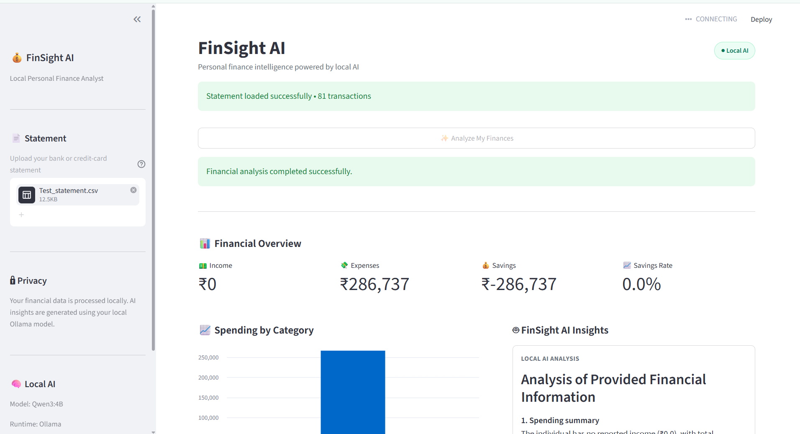
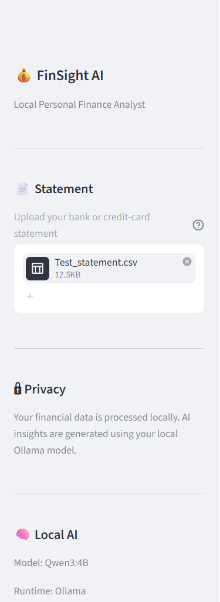
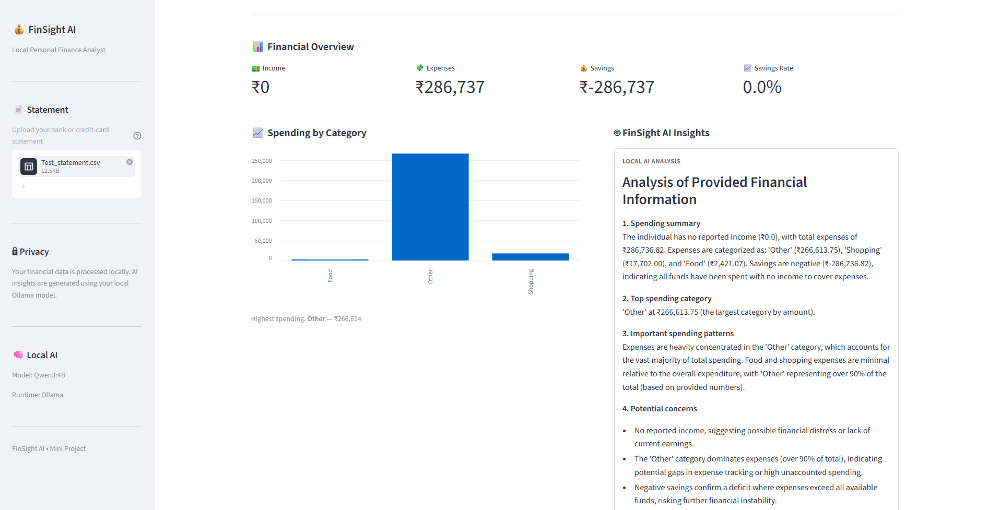

Absolutely. Replace your current `README.md` with the following. I’ve written it specifically for your **current MVP**, so it showcases what you actually built without claiming features that aren't implemented yet.

````markdown
# 💰 FinSight AI

### Local AI-Powered Personal Finance Analyst

FinSight AI is a hands-on **Applied AI mini project** that analyzes bank and credit-card transaction statements and generates spending insights using a locally running open-source Large Language Model (LLM).

I built this project as part of my journey into **Generative AI and Local LLM application development**.

The goal was simple:

> **Take what I'm learning about AI and integrate it into a real application that solves a problem I personally care about — understanding my spending patterns.**

Instead of sending financial data to a cloud AI API, FinSight AI uses **Ollama + Qwen3 locally**, allowing the AI analysis to run on the developer's machine.

---

## 🎯 Why FinSight AI?

Managing personal finances often means looking through bank statements, credit-card statements and transaction histories to understand where money is being spent.

FinSight AI aims to make this process simpler.

The application allows a user to upload a statement and receive:

- Financial summaries
- Category-wise spending
- Spending patterns
- Potential spending concerns
- AI-generated insights
- Practical recommendations

The project also helped me understand an important concept in Applied AI:

> **Not everything needs an LLM.**

Financial calculations are handled deterministically by the application, while the LLM is used where language understanding and interpretation add value.

---

# ✨ Features

## 📄 Statement Upload

Users can upload bank or credit-card statements through the Streamlit interface.

Supported formats include:

- CSV
- XLSX
- XLS

Supports common CSV/XLS/XLSX statement structures with automatic transaction-table detection and normalization.

---

## 📊 Financial Analysis

FinSight AI calculates key financial metrics including:

- Total income
- Total expenses
- Savings
- Savings rate
- Category-wise spending
- Highest spending category

Example:

```text
Income       → ₹75,000
Expenses     → ₹41,000
Savings      → ₹34,000
Savings Rate → 45.3%
````

These calculations are handled by the **FastAPI backend**, rather than relying on the LLM.

---

## 🤖 AI-Powered Financial Insights

After the financial calculations are completed, the summarized financial information is passed to the local LLM.

The AI generates insights such as:

* Spending summary
* Highest spending categories
* Spending patterns
* Potential concerns
* Practical suggestions

Example:

```text
Financial Data
      ↓
FastAPI Analysis
      ↓
Financial Summary
      ↓
Local Qwen3 LLM
      ↓
AI Spending Insights
```

---

# 🔐 Local-First AI

One of the main learning objectives of this project was experimenting with a **local open-source LLM**.

FinSight AI uses:

**Ollama + Qwen3**

instead of a cloud-based AI API.

This means the LLM inference runs locally on the developer's machine.

This approach is particularly interesting for applications involving sensitive information such as:

* Financial data
* Personal transactions
* Internal business information
* Confidential documents

> **Note:** This project is an educational MVP. Users should still avoid uploading sensitive financial information to environments where the application or machine is not trusted.

---

# 🏗️ Architecture

```text
                         USER
                           │
                           ▼
                ┌─────────────────────┐
                │     Streamlit       │
                │     Dashboard       │
                └──────────┬──────────┘
                           │
                           ▼
                ┌─────────────────────┐
                │ Python + Pandas     │
                │ Statement Processing│
                └──────────┬──────────┘
                           │
                           ▼
                ┌─────────────────────┐
                │      FastAPI        │
                │ Financial Analysis  │
                └──────────┬──────────┘
                           │
                           ▼
                ┌─────────────────────┐
                │   Financial Summary │
                └──────────┬──────────┘
                           │
                           ▼
                ┌─────────────────────┐
                │       Ollama        │
                │    Local Runtime    │
                └──────────┬──────────┘
                           │
                           ▼
                ┌─────────────────────┐
                │       Qwen3         │
                │     Local LLM       │
                └──────────┬──────────┘
                           │
                           ▼
                ┌─────────────────────┐
                │    AI Insights      │
                └──────────┬──────────┘
                           │
                           ▼
                ┌─────────────────────┐
                │ Streamlit Dashboard │
                └─────────────────────┘
```

---

# 🔄 Application Flow

The current MVP follows this flow:

```text
Bank / Credit Card Statement
            │
            ▼
     Statement Reader
            │
            ▼
    Transaction Data
            │
            ▼
        FastAPI
            │
            ├── Income
            ├── Expenses
            ├── Savings
            └── Categories
            │
            ▼
    Financial Summary
            │
            ▼
       Local LLM
      Qwen3 / Ollama
            │
            ▼
      AI Analysis
            │
            ▼
     Streamlit Dashboard
```

---

# 🧠 Where AI Fits

A key design decision in this project is separating **deterministic application logic** from **AI-powered interpretation**.

### Traditional application logic

The backend handles calculations such as:

```text
Income
Expenses
Savings
Savings Rate
Category Totals
```

For example:

```text
Income = ₹75,000
Expenses = ₹41,000

Savings = Income - Expenses

Savings = ₹34,000
```

These calculations should be deterministic and reproducible.

### AI layer

The LLM receives the calculated financial summary and interprets it.

For example:

```text
Financial Summary
       ↓
      LLM
       ↓
Spending Patterns
       ↓
Potential Concerns
       ↓
Practical Suggestions
```

This helped reinforce an important principle for me:

> **Use application logic where precision is required, and use AI where interpretation and natural-language reasoning add value.**

---

# 🛠️ Technology Stack

| Technology    | Purpose                                     |
| ------------- | ------------------------------------------- |
| **Python**    | Core application development                |
| **Pandas**    | Transaction and statement processing        |
| **FastAPI**   | Backend APIs and financial calculations     |
| **Streamlit** | Interactive dashboard and UI                |
| **Ollama**    | Local LLM runtime                           |
| **Qwen3**     | Open-source local LLM                       |
| **Requests**  | Communication between Streamlit and FastAPI |
| **OpenPyXL**  | XLSX statement processing                   |
| **xlrd**      | XLS statement processing                    |
| **Git**       | Version control                             |
| **GitHub**    | Source code and project documentation       |

---
## 🖥️ Application Preview

### Dashboard



### Statement Upload



### AI Financial Insights



---

# 📁 Project Structure

```text
FinSight-AI/
│
├── backend/
│   ├── main.py
│   ├── finance.py
│   └── statement_reader.py
│
├── frontend/
│   └── app.py
│
├── data/
│   ├── sample_transactions.csv
│   ├── sample_credit_card_statement.csv
│   └── sample_bank_statement.csv
│
├── screenshots/
│   ├── dashboard.png
│   ├── statement-upload.png
│   └── ai-insights.png
│
├── .gitignore
├── requirements.txt
└── README.md
```

---

# 🚀 Getting Started

## Prerequisites

Before running FinSight AI, install:

* Python 3.x
* Ollama
* Git
* VS Code

The project was developed and tested on Windows.

---

# 1. Clone the Repository

```bash
git clone <YOUR-GITHUB-REPOSITORY-URL>
```

Navigate into the project:

```bash
cd FinSight-AI
```

---

# 2. Create a Python Virtual Environment

```bash
python -m venv venv
```

---

# 3. Activate the Virtual Environment

### Windows PowerShell

```powershell
.\venv\Scripts\Activate.ps1
```

You should see:

```text
(venv)
```

in your terminal.

---

# 4. Install Python Dependencies

```powershell
python -m pip install -r requirements.txt
```

If `pip` is not recognized, use:

```powershell
python -m pip install -r requirements.txt
```

This project uses:

```text
FastAPI
Uvicorn
Streamlit
Pandas
Requests
OpenPyXL
xlrd
```

---

# 5. Install and Run Ollama

Install Ollama on your local machine.

Then download the Qwen3 model:

```bash
ollama pull qwen3:4b
```

Verify that the model is available:

```bash
ollama list
```

You should see the Qwen3 model listed.

---

# 6. Start the FastAPI Backend

From the project root:

```powershell
python -m uvicorn backend.main:app --reload
```

The FastAPI backend will start locally.

The API is responsible for:

* Processing financial data
* Calculating financial metrics
* Preparing financial summaries
* Communicating with the local LLM

---

# 7. Start Streamlit

Open another terminal.

Activate the virtual environment:

```powershell
.\venv\Scripts\Activate.ps1
```

Then run:

```powershell
python -m streamlit run frontend/app.py
```

The FinSight AI dashboard will open in your browser.

---

# 🧪 Example Use Case

A user uploads a transaction statement containing transactions such as:

```text
SWIGGY       ₹450
AMAZON       ₹2,500
UBER         ₹320
NETFLIX      ₹649
RELIANCE     ₹1,800
```

The application processes the transactions and produces a financial summary.

The summary is then passed to the local LLM.

The LLM can generate insights such as:

```text
Top Spending Category
Food

Potential Concern
Food spending represents a significant portion
of the current expenses.

Suggestion
Review recurring food-related transactions and
identify opportunities to reduce discretionary spending.
```

---

# 🔒 Privacy & Security

FinSight AI was designed as a **local-first learning project**.

The project does not require a cloud AI API for LLM inference.

However:

### Do NOT commit:

```text
Real bank statements
Real credit-card statements
Personal financial information
Passwords
API keys
.env files
```

Only synthetic or anonymized sample data should be included in the repository.

---

# 🧪 Testing & Real-World Learning

One of the most useful parts of building this MVP was testing it with statement formats that were different from the clean sample data.

Real-world statements can have:

* Different delimiters
* Different encodings
* Different column names
* Different transaction structures
* Metadata before transaction tables
* Different debit/credit representations

This exposed an important lesson:

> **Building a working prototype with controlled data is very different from building something that can handle real-world data.**

Statement parsing is therefore one of the areas identified for future improvement.

---

# ⚠️ Current Limitations

FinSight AI is an **MVP / learning project**, not a production financial application.

Current limitations include:

* Bank statement formats vary significantly
* Some statement structures may require additional parsing logic
* Transaction categorization can be improved
* LLM responses require validation
* AI-generated recommendations should not be treated as professional financial advice
* No persistent database
* No user authentication
* No multi-user support
* No historical multi-month analysis
* No production deployment

---

# 🔮 Future Improvements

The MVP provides a foundation for future experimentation.

Potential improvements include:

### Statement Intelligence

* Intelligent statement format detection
* Automatic column mapping
* Better CSV/XLS/XLSX parsing
* PDF statement support
* OCR-based statement processing

### Financial Intelligence

* Multi-month spending analysis
* Recurring expense detection
* Subscription detection
* Unusual transaction detection
* Spending trend analysis
* Budget recommendations
* Savings goals

### AI Capabilities

* Improved prompt engineering
* Structured LLM responses
* Better transaction categorization
* Conversational finance assistant
* Retrieval-Augmented Generation (RAG)
* AI agents for financial monitoring

### Application Improvements

* User authentication
* Persistent transaction storage
* Multi-user support
* Cloud deployment
* Mobile-friendly experience

---

# 📚 What I Learned

The biggest learning from this project wasn't simply getting an LLM to return a response.

It was understanding how multiple technologies come together to create an AI application.

```text
Python
   +
Data Processing
   +
FastAPI
   +
LLM
   +
Prompt Engineering
   +
Streamlit
   +
User Experience
```

I also learned that:

### 1. LLMs are not a replacement for application logic

Calculations should remain deterministic.

### 2. Prompt engineering has limitations

A prompt can guide an LLM, but it doesn't guarantee correctness.

### 3. Real-world data is messy

Clean sample data can hide many problems that appear with actual statements.

### 4. Local LLMs are practical

Running an open-source model locally provides an interesting alternative for applications involving sensitive data.

### 5. AI engineering is integration

The value is not just the model.

It is the combination of:

**Data + Software Engineering + AI + APIs + User Experience**

---

# 🎓 Learning Journey

This project is part of my hands-on exploration of:

```text
Generative AI
      ↓
Local LLMs
      ↓
AI Application Development
      ↓
AI Automation
      ↓
AI Agents
      ↓
Agentic AI
```

The approach is intentionally incremental:

**Build → Understand → Test → Learn → Improve → Integrate**

Instead of trying to build one large AI system immediately, I'm using small working projects to understand individual AI capabilities and gradually build stronger solutions.

---

# 👨‍💻 Project Background

FinSight AI started with a simple personal question:

> **"Can I use what I'm learning about AI to better understand my own spending?"**

That question became an opportunity to experiment with:

* Local LLMs
* Prompt engineering
* API integration
* Financial data processing
* Streamlit UI development
* AI-assisted analysis

This project represents my first step from **learning about Generative AI** to **building an application with Generative AI**.

---

# 🙏 Acknowledgement

A special thanks to my mentors for their guidance, feedback and encouragement throughout this learning journey.

Their support helped me move beyond understanding AI concepts theoretically and start experimenting with them through hands-on implementation.

---

# 📌 Project Status

**Current Version:** V1 — MVP

**Status:** Completed ✅

The current version demonstrates the core concept of a local AI-powered personal finance analyst.

Future versions will focus on improving robustness, intelligence, usability and real-world statement compatibility.

---

# ⚠️ Disclaimer

FinSight AI is an educational and experimental software project.

The financial insights and recommendations generated by the application are for informational purposes only and should not be considered professional financial, investment or tax advice.

Always validate financial decisions using appropriate professional guidance.

---

# 📜 License

This project is created for educational and learning purposes.